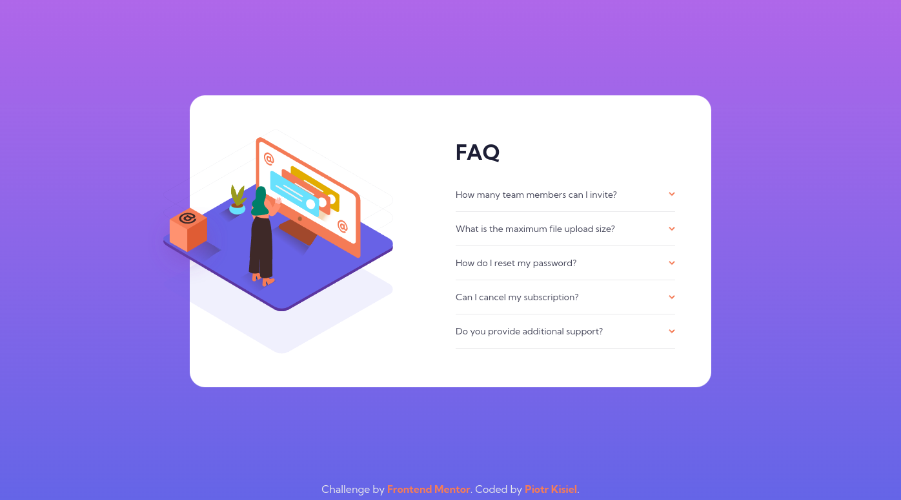

# FAQ accordion card

This is a solution to the [FAQ accordion card challenge on Frontend Mentor](https://www.frontendmentor.io/challenges/faq-accordion-card-XlyjD0Oam).

## Table of contents

-   [Overview](#overview)
    -   [The challenge](#the-challenge)
    -   [Screenshot](#screenshot)
        -   [Desktop view](#desktop-view)
        -   [Mobile view](#mobile-view)
    -   [Links](#links)
-   [My process](#my-process)
    -   [Built with](#built-with)
    -   [What I learned](#what-i-learned)
-   [Author](#author)

## Overview

### The challenge

Users should be able to:

-   View the optimal layout for the component depending on their device's screen size
-   See hover states for all interactive elements on the page
-   Hide/Show the answer to a question when the question is clicked
-   **Bonus**: Complete the challenge without using JavaScript

### Screenshot

#### Desktop view

#### Mobile view

### Links

-   [Solution URL](https://github.com/pietyr/faq-accordion-card)
-   [Live Site URL](https://pietyr.github.io/faq-accordion-card/)

## My process

### Built with

-   Semantic HTML5 markup
-   CSS custom properties
-   Flexbox
-   Mobile-first workflow

### What I learned

-   How to create collapsible elements without JavaScript
-   How to position SVG decorational images

## Author

-   GitHub [@pietyr](https://github.com/pietyr)
-   Frontend Mentor - [@pietyr](https://www.frontendmentor.io/profile/pietyr)
